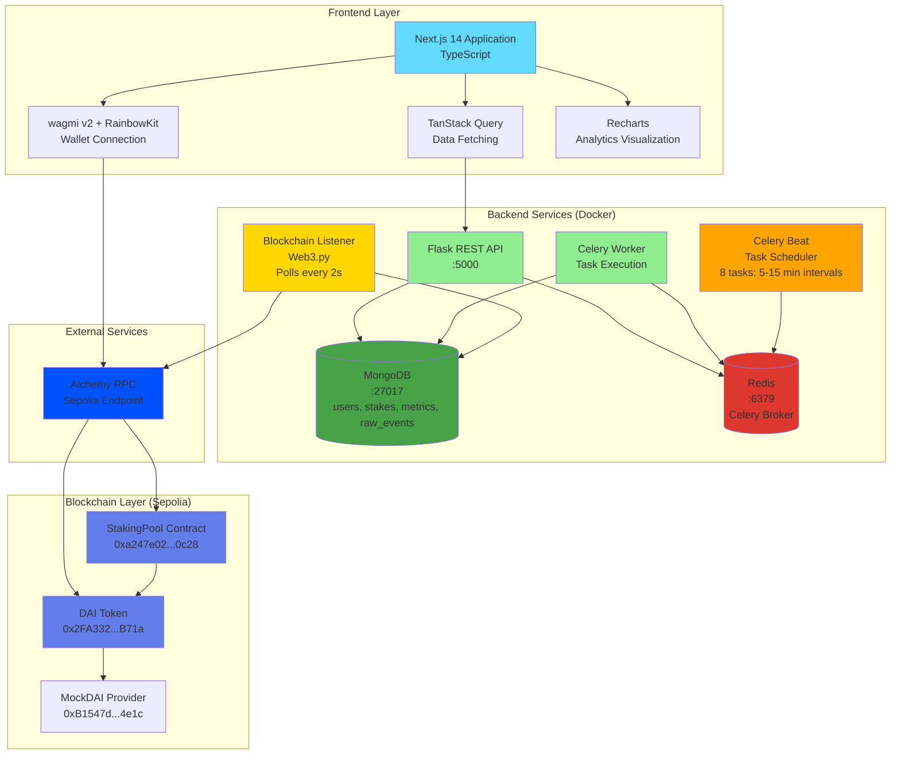
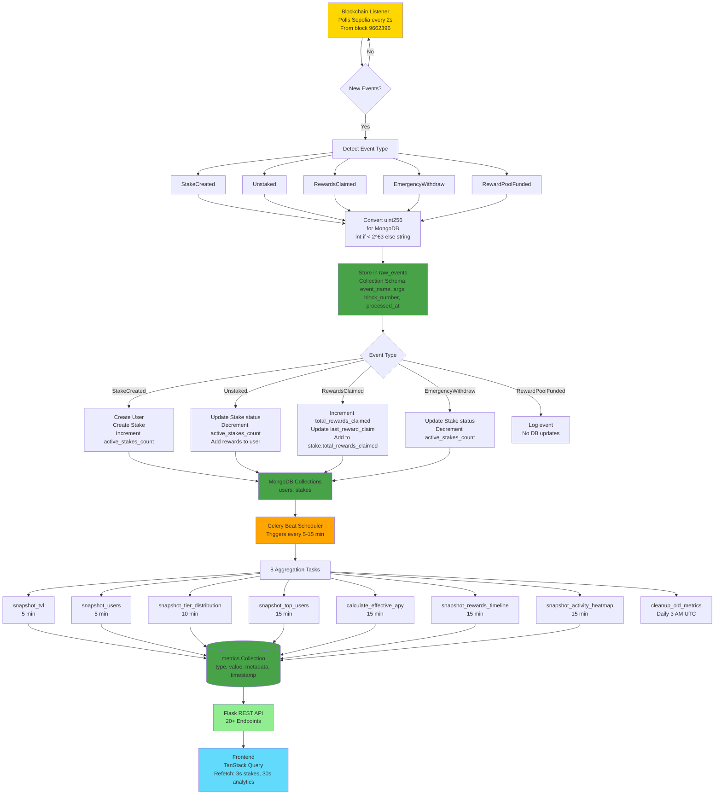
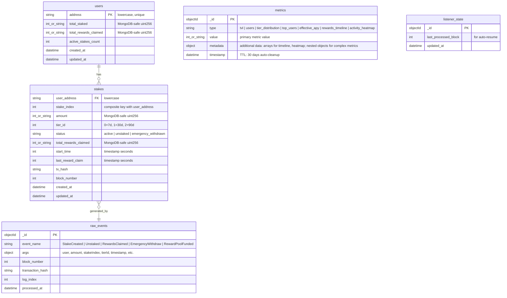

# ChainStaker - System Architecture

This document provides a comprehensive technical overview of the ChainStaker platform architecture, including detailed component interactions, data flow, and database schema.

## Table of Contents

1. [Complete System Architecture](#complete-system-architecture)
2. [Event Processing Flow](#event-processing-flow)
3. [MongoDB Data Schema](#mongodb-data-schema)
4. [Component Descriptions](#component-descriptions)
5. [Technology Choices](#technology-choices)
6. [Scalability Considerations](#scalability-considerations)

---

## Complete System Architecture

The following diagram shows the complete technical architecture of ChainStaker, including all components and their interactions:

---

## Event Processing Flow

This diagram illustrates how blockchain events are captured, stored, and aggregated into analytics metrics:

---

## MongoDB Data Schema

This entity-relationship diagram shows the structure of MongoDB collections and their relationships:

**Key Schema Notes**:

- **uint256 Storage**: Values < 2^63 stored as MongoDB int, values >= 2^63 stored as string (via `convert_uint256_for_mongodb()`)
- **Aggregation Pattern**: Use `convert_to_double('$field')` in MongoDB aggregation pipelines to handle mixed int/string types
- **Composite Keys**: `stakes` uses (`user_address`, `stake_index`) as unique identifier
- **Indexes**: `users.address` (unique), `stakes` on (`user_address`, `stake_index`), `raw_events.timestamp`, `metrics.timestamp` (TTL 30 days)

---

## Component Descriptions

### Frontend Layer

**Next.js 14 Application**
- Server-side rendering (SSR) and static site generation (SSG) for optimal performance
- TypeScript for type safety across components, hooks, and API interactions
- TailwindCSS for responsive styling

**wagmi v2 + RainbowKit**
- wagmi provides React hooks for Ethereum interactions (`useAccount`, `useContractWrite`, `useContractRead`)
- RainbowKit handles wallet connection UI (MetaMask, WalletConnect, Coinbase Wallet, etc.)
- Configured for Sepolia testnet (Chain ID: 11155111)

**TanStack Query (React Query)**
- Data fetching with automatic caching and refetching (3s for stakes, 30s for analytics)
- Optimistic updates for better UX during transactions
- Error handling and retry logic

**Recharts**
- Line charts for TVL sparkline and rewards timeline
- Heatmaps for hourly activity visualization
- Leaderboard tables for top stakers

### Backend Services

**Flask REST API**
- CORS-enabled for cross-origin requests from Next.js frontend
- 20+ endpoints organized into blueprints: users, stakes, analytics, TVL sparkline
- JWT authentication (planned for future admin features)

**MongoDB**
- Document database for flexible schema (handles Solidity uint256 with custom conversion)
- Time-series collections for metrics with TTL indexes (auto-cleanup after 30 days)
- Aggregation pipelines for complex analytics queries

**Redis**
- Message broker for Celery task queue
- Result backend for task status tracking
- AOF persistence enabled for durability

**Celery Worker**
- Asynchronous task execution for analytics aggregation
- Handles 8 scheduled tasks (TVL snapshots, user stats, tier distribution, etc.)
- Retry logic with exponential backoff for transient failures

**Celery Beat**
- Cron-like scheduler for periodic tasks
- Triggers tasks every 5-15 minutes (varies by task)
- Daily cleanup at 3 AM UTC for old metrics

**Blockchain Listener**
- Polls Sepolia RPC endpoint every 2 seconds for new blocks
- Processes blocks in batches (configurable `BATCH_SIZE`)
- Stores last processed block in `listener_state` collection for auto-resume after restart
- Converts uint256 values to MongoDB-safe format before storage

### Blockchain Layer

**StakingPool Contract**
- Main entry point for user interactions
- Inherits from StakingAdmin → StakingRewards → StakingCore
- Uses StakingMath library for gas-optimized calculations

**DAI Token**
- ERC20 token used for staking
- MockDAI implementation for Sepolia testnet (public `mint()` function)

**MockDAI Provider**
- Test utility for adjusting DAI price (for penalty calculation testing)
- Not used in production, but available for edge case testing

---

## Technology Choices

### Why MongoDB?

1. **Flexible Schema**: Handles Solidity uint256 values (up to 2^256) by storing as int (< 2^63) or string (>= 2^63)
2. **Time-Series Optimization**: Efficient storage and querying of historical metrics
3. **Aggregation Pipelines**: Complex analytics queries (TVL history, rewards timeline) in single database operations
4. **TTL Indexes**: Automatic cleanup of old metrics (30-day retention) without manual cron jobs

### Why Celery?

1. **Asynchronous Analytics**: Aggregation tasks run in background without blocking API requests
2. **Scheduled Tasks**: Built-in cron-like scheduler (Celery Beat) for periodic metric snapshots
3. **Scalability**: Can scale to multiple worker nodes if needed
4. **Retry Logic**: Automatic retry with exponential backoff for transient errors

### Why wagmi v2?

1. **Type-Safe**: End-to-end TypeScript typing from contract ABIs to React hooks
2. **React Hooks**: Idiomatic React patterns for Ethereum interactions
3. **Caching**: Automatic caching of contract reads with configurable refetch intervals
4. **RainbowKit Integration**: Seamless wallet connection UI with minimal configuration

### Why Foundry?

1. **Fast Tests**: Solidity tests run 10x faster than Hardhat (all tests in 2-3 seconds)
2. **Fuzzing**: Property-based testing with automatic fuzzing (`forge test --fuzz-runs 10000`)
3. **Gas Optimization**: Built-in gas profiling (`forge test --gas-report`)
4. **No JavaScript**: Pure Solidity development environment

---

## Scalability Considerations

### Current Architecture (Single-Server Deployment)

- All services run on single Docker host
- Suitable for testnet deployment and demonstration purposes
- MongoDB handles ~1,000 events/day with ease
- Celery tasks complete in < 1 second each

### Production Scaling Strategies

**1. Horizontal Scaling**
- Add multiple Celery workers for parallel task execution
- Use MongoDB replica set for read scalability (primary for writes, secondaries for reads)
- Deploy Flask API behind load balancer (multiple API instances)

**2. Caching Layer**
- Add Redis caching for frequently accessed data (TVL, user stats)
- Cache TTL: 30 seconds (matching Celery task frequency)
- Invalidate cache on write operations (new stake, claim, unstake)

**3. Event Processing Optimization**
- Batch event processing (current: 100 blocks/batch, can increase to 1,000)
- Parallel event handlers (use multiprocessing for heavy aggregations)
- Consider event streaming (Kafka/RabbitMQ) for high-throughput scenarios

**4. Database Sharding**
- Shard `stakes` collection by `user_address` for write scalability
- Keep `users` and `metrics` unsharded (smaller collections)
- Use MongoDB Atlas auto-sharding for managed solution

**5. Frontend Optimization**
- CDN for static assets (Vercel Edge Network)
- ISR (Incremental Static Regeneration) for dashboard pages
- WebSockets for real-time updates (alternative to polling)

### Security Considerations

**Smart Contracts**
- ReentrancyGuard on all state-changing functions
- Pausable pattern for emergency stops
- Ownable for admin-only functions (tier updates, fee changes)
- No private keys in backend (event listener is read-only)

**Backend**
- CORS restricted to frontend domain (not `*` in production)
- Environment variables for secrets (MongoDB URI, RPC URLs)
- Rate limiting on API endpoints (planned: Flask-Limiter)

**Frontend**
- Wallet signatures for all transactions (MetaMask, WalletConnect)
- No private key storage (wagmi uses browser wallet)
- HTTPS only in production (Vercel enforces TLS)

---

## Performance Metrics

**Current Testnet Performance**:
- Blockchain Listener: Processes 100 blocks in ~5 seconds
- Celery Tasks: Each task completes in 0.5-1 second
- API Response Times: < 100ms for most endpoints, < 500ms for complex analytics
- Frontend Load Time: ~1.5s initial load (Next.js SSR), < 100ms navigation (client-side routing)

**Database Size (After 1 Week)**:
- `raw_events`: ~5,000 documents (~2 MB)
- `stakes`: ~500 documents (~500 KB)
- `users`: ~100 documents (~50 KB)
- `metrics`: ~10,000 documents (30-day retention, ~5 MB)

---

For API details, see [API.md](../api/API.md).
For smart contract architecture, see [CONTRACTS.md](../smart-contracts/CONTRACTS.md).
For deployment instructions, see [SEPOLIA.md](../deployment/SEPOLIA.md).
