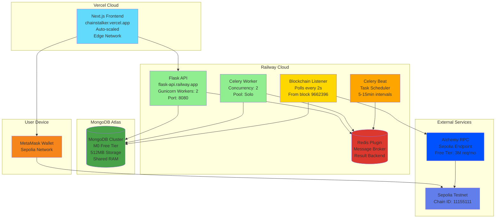
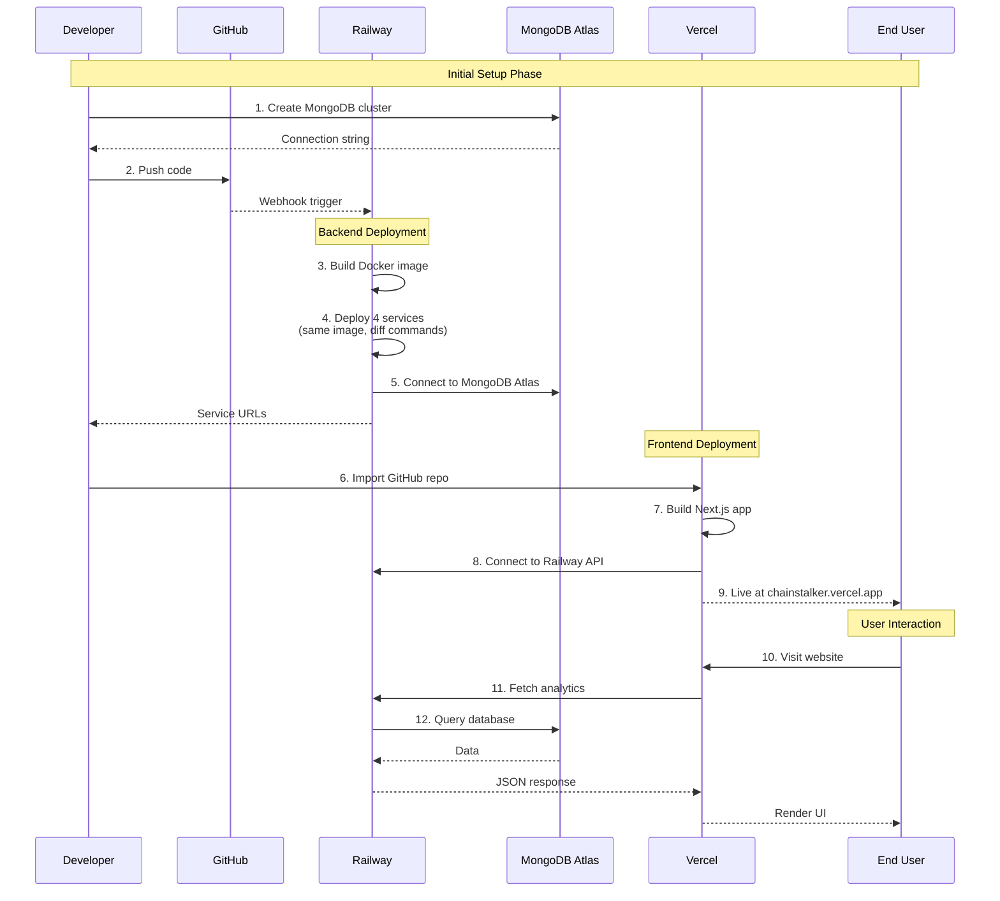

# ChainStalker - Production Deployment Guide

Complete production deployment guide for ChainStalker on Railway (backend) and Vercel (frontend) using Sepolia testnet.

## Table of Contents

1. [Production Architecture](#production-architecture)
2. [Deployment Overview](#deployment-overview)
3. [Railway Backend Setup](#railway-backend-setup)
4. [MongoDB Atlas Configuration](#mongodb-atlas-configuration)
5. [Vercel Frontend Deployment](#vercel-frontend-deployment)
6. [Environment Variables](#environment-variables)
7. [Verification & Testing](#verification--testing)
8. [Cost Analysis](#cost-analysis)

---

## Production Architecture

### Infrastructure Overview



**Key Components**:
- **Vercel**: Frontend hosting (Next.js 14, serverless, global CDN)
- **Railway**: Backend services (4 containers + Redis plugin)
- **MongoDB Atlas**: Database (M0 free tier, 512MB)
- **Alchemy**: Blockchain RPC provider (3M requests/month free)

---

## Deployment Overview

### Why This Architecture?

**Railway vs Docker Compose**:
- ❌ **Local Docker**: 6 containers (Flask, MongoDB, Redis, 3 workers) - not production-ready
- ✅ **Railway**: 4 services + Redis plugin - managed infrastructure, auto-scaling, free SSL

**MongoDB Atlas vs Railway MongoDB**:
- ❌ **Railway MongoDB**: 1GB storage limit on free tier (insufficient for analytics)
- ✅ **MongoDB Atlas**: M0 free tier with 512MB (sufficient for testnet usage)

**Procfile Strategy**:
- Railway uses **same Docker image** for all 4 services
- Each service runs different **Start Command** from `backend/Procfile`
- Dockerfile builds once, deployed to 4 separate containers

### Deployment Flow Diagram



---

## Railway Backend Setup

### Prerequisites

1. **GitHub Account** with ChainStalker repository
2. **Railway Account** (sign up at [railway.app](https://railway.app))
3. **MongoDB Atlas Account** (see next section)
4. **Alchemy API Key** (get free tier at [alchemy.com](https://alchemy.com))

### Step 1: Create Railway Project

```bash
# Login to Railway
railway login

# Initialize project (optional - can also use GUI)
railway init
```

**Or use Railway Dashboard**:
1. Go to [railway.app/new](https://railway.app/new)
2. Click "New Project" → "Deploy from GitHub repo"
3. Select `ChainStalker` repository
4. Railway will auto-detect the Dockerfile

### Step 2: Add Redis Plugin

1. Railway Dashboard → Your Project
2. Click "+ New" → "Database" → "Add Redis"
3. Redis will auto-generate `REDIS_URL` variable
4. This URL will be available as `${{Redis.REDIS_URL}}` to other services

### Step 3: Deploy Flask API

1. **Add Service**: "+ New" → "GitHub Repo" → `ChainStalker`
2. **Settings → General**:
   - Service Name: `flask-api`
   - Root Directory: `backend`
3. **Settings → Deploy**:
   - Config File Path: `backend/railway-api.json`
   - Custom Start Command: `gunicorn --bind 0.0.0.0:$PORT --workers 2 --timeout 120 run:app`
   - Healthcheck Path: `/health`
   - Healthcheck Timeout: 100s
4. **Settings → Networking**:
   - Generate Domain (e.g., `flask-api-production-xxxx.up.railway.app`)
5. **Variables**: Add environment variables (see [Environment Variables](#environment-variables))
6. **Deploy**

### Step 4: Deploy Celery Worker

1. **Add Service**: "+ New" → "GitHub Repo" → `ChainStalker` (same repo)
2. **Settings → General**:
   - Service Name: `celery-worker`
   - Root Directory: `backend`
3. **Settings → Deploy**:
   - Config File Path: `backend/railway-worker.json`
   - Custom Start Command: `celery -A app.tasks.celery_app worker --loglevel=info --concurrency=2 --pool=solo`
   - ⚠️ **No healthcheck** (worker is not a web server)
4. **Variables**: Copy from `flask-api` (MONGODB_URI, REDIS_URL, etc.)
5. **Deploy**

### Step 5: Deploy Celery Beat

1. **Add Service**: "+ New" → "GitHub Repo" → `ChainStalker`
2. **Settings → General**:
   - Service Name: `celery-beat`
   - Root Directory: `backend`
3. **Settings → Deploy**:
   - Config File Path: `backend/railway-beat.json`
   - Custom Start Command: `celery -A app.tasks.celery_app beat --loglevel=info`
   - ⚠️ **No healthcheck**
4. **Variables**: MONGODB_URI, REDIS_URL
5. **Deploy**

### Step 6: Deploy Blockchain Listener

1. **Add Service**: "+ New" → "GitHub Repo" → `ChainStalker`
2. **Settings → General**:
   - Service Name: `blockchain-listener`
   - Root Directory: `backend`
3. **Settings → Deploy**:
   - Config File Path: `backend/railway-listener.json`
   - Custom Start Command: `python -m app.services.blockchain_listener`
   - ⚠️ **No healthcheck**
4. **Variables**: MONGODB_URI, WEB3_PROVIDER_URI, STAKING_POOL_ADDRESS, START_BLOCK
5. **Deploy**

### Railway Services Summary

| Service | Start Command | Healthcheck | Public Domain |
|---------|---------------|-------------|---------------|
| **flask-api** | `gunicorn --bind 0.0.0.0:$PORT --workers 2 --timeout 120 run:app` | ✅ `/health` | ✅ Auto-generated |
| **celery-worker** | `celery -A app.tasks.celery_app worker --loglevel=info --concurrency=2 --pool=solo` | ❌ | ❌ |
| **celery-beat** | `celery -A app.tasks.celery_app beat --loglevel=info` | ❌ | ❌ |
| **blockchain-listener** | `python -m app.services.blockchain_listener` | ❌ | ❌ |
| **redis** | (Managed plugin) | ✅ | ❌ |

---

## MongoDB Atlas Configuration

### Why MongoDB Atlas?

Railway's free tier MongoDB has a **1GB storage limit**, which is insufficient for storing:
- Raw blockchain events (`raw_events` collection)
- Time-series analytics metrics (`metrics` collection)
- User stakes and historical data

MongoDB Atlas M0 free tier provides:
- **512MB storage** (sufficient for testnet usage)
- **Shared RAM** (adequate for low-traffic apps)
- **Free forever** (no trial period like Railway)

### Setup Steps

1. **Create Account**: Sign up at [mongodb.com/cloud/atlas](https://www.mongodb.com/cloud/atlas)

2. **Create Cluster**:
   - Click "Build a Database"
   - Choose **M0 Free Tier**
   - Provider: AWS (recommended)
   - Region: Closest to your Railway region (e.g., `us-east-1`)
   - Cluster Name: `chainstaker`

3. **Create Database User**:
   - Security → Database Access → "Add New Database User"
   - Username: `chainstaker-app`
   - Password: Generate secure password (save it!)
   - Database User Privileges: "Read and write to any database"

4. **Configure Network Access**:
   - Security → Network Access → "Add IP Address"
   - Select **"Allow Access from Anywhere"** (`0.0.0.0/0`)
   - ⚠️ This is safe for free tier with authentication, but use IP whitelist in production

5. **Get Connection String**:
   - Deployment → Database → "Connect"
   - Choose "Connect your application"
   - Driver: Python, Version: 3.12 or later
   - Copy connection string:
     ```
     mongodb+srv://chainstaker-app:<password>@chainstaker.xxxxx.mongodb.net/?retryWrites=true&w=majority&appName=chainstaker
     ```
   - Replace `<password>` with your actual password

6. **Create Database**:
   - Atlas Dashboard → Browse Collections → "Add My Own Data"
   - Database Name: `chainstaker`
   - Collection Name: `stakes` (others will be auto-created)

### Migrating Data from Local MongoDB

If you have existing data from local Docker MongoDB:

**Option 1: MongoDB Compass (GUI)**:
1. Connect to local MongoDB: `mongodb://localhost:27017`
2. Select `chainstaker` database
3. For each collection (`raw_events`, `stakes`, `users`):
   - Select all documents → Export to JSON
   - Connect to MongoDB Atlas
   - Import JSON to corresponding collection

**Option 2: mongodump/mongorestore (CLI)**:
```bash
# Export from local Docker
docker exec chainstaker-mongodb mongodump --db=chainstaker --out=/dump
docker cp chainstaker-mongodb:/dump ./mongodb-backup

# Install MongoDB Tools
# Windows: https://www.mongodb.com/try/download/database-tools
# Mac: brew install mongodb-database-tools

# Import to Atlas
mongorestore --uri="mongodb+srv://chainstaker-app:<password>@chainstaker.xxxxx.mongodb.net/" --db=chainstaker ./mongodb-backup/chainstaker
```

---

## Vercel Frontend Deployment

### Prerequisites

- **Vercel Account** (sign up at [vercel.com](https://vercel.com) with GitHub)
- **Railway Flask API URL** (from previous step)

### Deployment Steps

1. **Import Project**:
   - Go to [vercel.com/new](https://vercel.com/new)
   - Click "Import Git Repository"
   - Select `ChainStalker` from GitHub

2. **Configure Project**:
   - Framework Preset: **Next.js** (auto-detected)
   - Root Directory: `frontend`
   - Build Command: `npm run build` (default)
   - Output Directory: `.next` (default)

3. **Environment Variables**:
   Add the following variables (see full list below):
   ```
   NEXT_PUBLIC_API_URL=https://flask-api-production-xxxx.up.railway.app
   NEXT_PUBLIC_RPC_URL=https://eth-sepolia.g.alchemy.com/v2/YOUR_KEY
   NEXT_PUBLIC_STAKING_POOL_ADDRESS=0xa247e02E9309cCEB1D1b9b301607f067d0a70c28
   NEXT_PUBLIC_DAI_TOKEN_ADDRESS=0x2FA332E8337642891885453Fd40a7a7Bb010B71a
   NEXT_PUBLIC_WALLETCONNECT_PROJECT_ID=376bb626351a8984fc856f9b4b46c831
   ```

4. **Deploy**:
   - Click "Deploy"
   - Wait 2-3 minutes for build
   - Vercel will generate URL: `https://chainstalker.vercel.app`

5. **Custom Domain** (Optional):
   - Settings → Domains → Add Domain
   - Configure DNS records (A/CNAME)

### Vercel Configuration

**Auto-scaling**:
- Vercel automatically scales based on traffic
- Free tier: Unlimited deployments, 100GB bandwidth/month

**Edge Network**:
- Global CDN for fast loading worldwide
- Automatic HTTPS with SSL certificates

---

## Environment Variables

### Railway Services

**All Services Need**:
```bash
# MongoDB Atlas connection
MONGODB_URI=mongodb+srv://chainstaker-app:<password>@chainstaker.xxxxx.mongodb.net/?retryWrites=true&w=majority&appName=chainstaker

# Redis (auto-injected by Railway plugin)
REDIS_URL=${{Redis.REDIS_URL}}
```

**flask-api Additional Variables**:
```bash
# Flask
FLASK_ENV=production
FLASK_DEBUG=0
PORT=8080

# Blockchain
WEB3_PROVIDER_URI=https://eth-sepolia.g.alchemy.com/v2/YOUR_ALCHEMY_KEY
STAKING_POOL_ADDRESS=0xa247e02E9309cCEB1D1b9b301607f067d0a70c28
DAI_TOKEN_ADDRESS=0x2FA332E8337642891885453Fd40a7a7Bb010B71a
CHAIN_ID=11155111

# CORS (allow Vercel frontend)
CORS_ORIGINS=https://chainstalker.vercel.app,http://localhost:3000
```

**blockchain-listener Additional Variables**:
```bash
WEB3_PROVIDER_URI=https://eth-sepolia.g.alchemy.com/v2/YOUR_ALCHEMY_KEY
STAKING_POOL_ADDRESS=0xa247e02E9309cCEB1D1b9b301607f067d0a70c28
START_BLOCK=9662396
POLL_INTERVAL=2
```

### Vercel Frontend

```bash
# API Backend (Railway Flask API URL)
NEXT_PUBLIC_API_URL=https://flask-api-production-xxxx.up.railway.app

# Blockchain RPC
NEXT_PUBLIC_RPC_URL=https://eth-sepolia.g.alchemy.com/v2/YOUR_ALCHEMY_KEY

# Deployed Contracts
NEXT_PUBLIC_STAKING_POOL_ADDRESS=0xa247e02E9309cCEB1D1b9b301607f067d0a70c28
NEXT_PUBLIC_DAI_TOKEN_ADDRESS=0x2FA332E8337642891885453Fd40a7a7Bb010B71a

# Network
NEXT_PUBLIC_CHAIN_ID=11155111

# WalletConnect
NEXT_PUBLIC_WALLETCONNECT_PROJECT_ID=376bb626351a8984fc856f9b4b46c831
```

**Security Notes**:
- ✅ All frontend variables start with `NEXT_PUBLIC_` (safe to expose)
- ❌ Never put private keys in environment variables
- ✅ Use separate Alchemy keys for frontend and backend
- ✅ Rotate MongoDB Atlas password regularly

---

## Verification & Testing

### Railway Backend Health Check

**1. Test Flask API**:
```bash
# Health check
curl https://flask-api-production-xxxx.up.railway.app/health

# Expected response:
{
  "status": "healthy",
  "mongodb": "connected",
  "redis": "connected"
}

# Test analytics endpoint
curl https://flask-api-production-xxxx.up.railway.app/api/analytics | jq
```

**2. Check Railway Logs**:
```bash
# Railway Dashboard → Service → Logs

# flask-api logs:
[INFO] Gunicorn: Listening at: http://0.0.0.0:8080
[INFO] MongoDB connected successfully
[INFO] Redis connected successfully

# celery-worker logs:
[INFO] celery@xxx ready.
[INFO] Connected to redis://redis.railway.internal:6379

# celery-beat logs:
[INFO] Scheduler: Sending due task snapshot_tvl
[INFO] Scheduler: Sending due task snapshot_users

# blockchain-listener logs:
[INFO] Starting blockchain listener from block 9662396
[INFO] Processing blocks 9662396 to 9662500
```

**3. Verify MongoDB Atlas**:
```bash
# MongoDB Atlas Dashboard → Browse Collections

# Expected collections:
- chainstaker.stakes (documents with user stakes)
- chainstaker.users (user statistics)
- chainstaker.raw_events (blockchain events)
- chainstaker.metrics (analytics snapshots)
- chainstaker.listener_state (last processed block)

# Check metrics are being created
# Should have new documents every 5-15 minutes
```

### Vercel Frontend Testing

**1. Access Website**:
```bash
# Open in browser
https://chainstalker.vercel.app

# Expected:
- Dashboard loads
- "Connect Wallet" button visible
- TVL displays (may be $0 initially)
```

**2. Connect Wallet**:
- Click "Connect Wallet"
- Select MetaMask
- Ensure Sepolia network is selected (Chain ID: 11155111)
- Approve connection

**3. Create Test Stake**:
- Get test DAI from faucet (if needed)
- Approve DAI spending
- Create stake (e.g., 1000 DAI, Tier 1: 30 days)
- Wait 30 seconds for blockchain listener to process event
- Refresh dashboard → should see new stake

**4. Verify Analytics**:
- Wait 5-15 minutes for Celery tasks to run
- Dashboard should update with:
  - TVL (total staked amount)
  - Active stakes count
  - Top 3 stakers
- Navigate to `/history` page:
  - TVL History chart
  - Rewards Timeline chart
  - Activity Heatmap
  - Top Stakers Leaderboard

---

## Cost Analysis

### Railway Free Tier

**Trial Details**:
- **Duration**: 30 days OR $5 credit (whichever comes first)
- **What happens after trial**: Services pause unless you upgrade to Hobby plan

**Usage Estimation** (4 services + Redis):
- flask-api: ~$3/month (2 workers, low traffic)
- celery-worker: ~$2/month (light tasks)
- celery-beat: ~$1/month (minimal CPU)
- blockchain-listener: ~$2/month (constant polling)
- Redis plugin: ~$2/month

**Total**: ~$10-15/month on Hobby plan ($5 base + usage)

### MongoDB Atlas Free Tier

**M0 Free Tier**:
- ✅ **Free forever** (no trial period)
- Storage: 512MB
- RAM: Shared
- Sufficient for testnet usage (estimated 100MB for 1000 stakes)

### Vercel Free Tier

**Hobby Plan** (Free):
- ✅ **Free forever**
- 100GB bandwidth/month
- Unlimited deployments
- Sufficient for testnet/demo usage

### Alchemy Free Tier

**Free Plan**:
- ✅ **Free forever**
- 3 million requests/month
- Sufficient for testnet (estimated 1M req/month with 2s polling)

### Alternative: Render

**Render Free Tier**:
- ✅ Free forever (no trial)
- ❌ Services sleep after 15 minutes of inactivity
- ❌ Slow cold starts (30-60 seconds)
- ❌ 750 hours/month per service (need 4 services = need paid plan)

**Render Paid**:
- $7/month per service
- Total: 4 services × $7 = **$28/month**

**Recommendation**:
- **Demo/Testing (30 days)**: Railway free trial
- **Long-term free**: MongoDB Atlas + Vercel + self-host backend
- **Production**: Railway Hobby (~$15/month) - best value

---

## Troubleshooting

### Railway Deployment Failures

**Error**: `Healthcheck failure` on celery-worker
- **Cause**: Worker services are not web servers, don't respond to HTTP
- **Solution**: Use `railway-worker.json` config without healthcheck

**Error**: `DNS query name does not exist` (MongoDB)
- **Cause**: Missing `dnspython` package for `mongodb+srv://` connections
- **Solution**: Ensure `dnspython==2.4.2` in `requirements.txt`

**Error**: `Container keeps restarting`
- **Cause**: Invalid environment variables (e.g., wrong MONGODB_URI)
- **Solution**: Check Railway logs, verify all variables are set correctly

### MongoDB Atlas Issues

**Error**: `Authentication failed`
- **Cause**: Wrong username/password in connection string
- **Solution**: Verify credentials in Atlas → Database Access

**Error**: `Connection timeout`
- **Cause**: IP not whitelisted
- **Solution**: Atlas → Network Access → Add `0.0.0.0/0` (allow all)

### Vercel Build Failures

**Error**: `Module not found` during build
- **Cause**: Missing dependencies in `package.json`
- **Solution**: Run `npm install` locally, commit `package-lock.json`

**Error**: `API requests failing (CORS)`
- **Cause**: Railway Flask API not allowing Vercel domain
- **Solution**: Add `CORS_ORIGINS=https://chainstalker.vercel.app` to Railway flask-api

---

## Next Steps

**After Successful Deployment**:

1. **Monitor Usage**:
   - Railway Dashboard → Usage tab (track credits)
   - MongoDB Atlas → Metrics tab (storage usage)
   - Vercel Dashboard → Analytics tab (bandwidth)

2. **Set Up Alerts**:
   - Railway: Email notifications for deployment failures
   - MongoDB Atlas: Alerts for storage >80%
   - Vercel: Alerts for quota exceeded

3. **Upgrade Considerations**:
   - Railway: Upgrade to Hobby ($5/month) before trial ends
   - MongoDB Atlas: Upgrade to M10 ($0.08/hour) for production
   - Vercel: Upgrade to Pro ($20/month) for analytics & team features

---

For local development setup, see [SEPOLIA.md](SEPOLIA.md).
For architecture details, see [ARCHITECTURE.md](../architecture/ARCHITECTURE.md).
For API documentation, see [API.md](../api/API.md).
