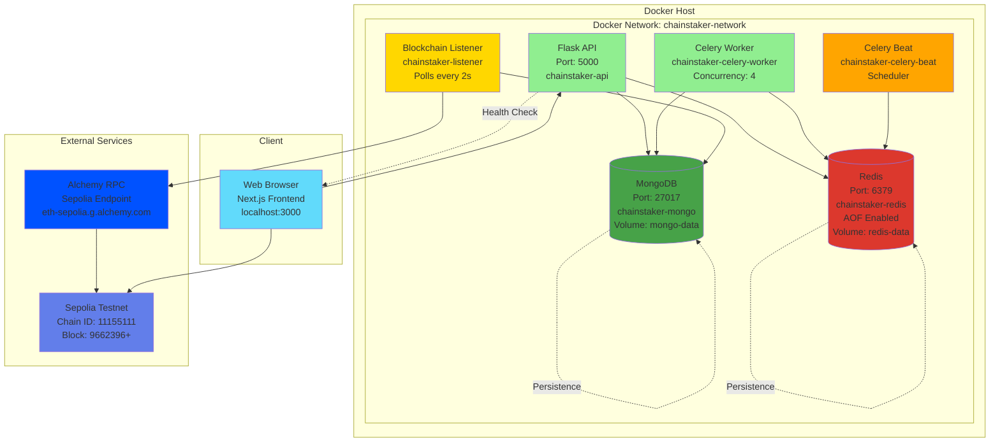

# ChainStalker - Sepolia Deployment Guide

Complete deployment guide for ChainStaker on Sepolia testnet, including Docker infrastructure setup and environment configuration.

## Table of Contents

1. [Deployment Architecture](#deployment-architecture)
2. [Sepolia Testnet Details](#sepolia-testnet-details)
3. [Docker Compose Setup](#docker-compose-setup)
4. [Environment Variables](#environment-variables)
5. [Deployment Procedure](#deployment-procedure)
6. [Testing & Verification](#testing--verification)
7. [Troubleshooting](#troubleshooting)

---

## Deployment Architecture

The following diagram shows the complete deployment architecture with Docker containers and external services:



**Key Components**:
- **6 Docker Containers**: Flask API, MongoDB, Redis, Celery Worker, Celery Beat, Blockchain Listener
- **2 Persistent Volumes**: `mongo-data` (MongoDB), `redis-data` (Redis AOF)
- **1 Docker Network**: `chainstaker-network` (bridge mode)
- **External RPC**: Alchemy Sepolia endpoint for blockchain access

---

## Sepolia Testnet Details

### Network Information

| Parameter | Value |
|-----------|-------|
| Network Name | Sepolia |
| Chain ID | 11155111 |
| Currency Symbol | SepoliaETH |
| Block Explorer | https://sepolia.etherscan.io |
| RPC Endpoint | https://eth-sepolia.g.alchemy.com/v2/{API_KEY} |

### Deployed Contracts

| Contract | Address | Etherscan |
|----------|---------|-----------|
| StakingPool | `0xa247e02E9309cCEB1D1b9b301607f067d0a70c28` | [View](https://sepolia.etherscan.io/address/0xa247e02E9309cCEB1D1b9b301607f067d0a70c28) |
| DAI Token | `0x2FA332E8337642891885453Fd40a7a7Bb010B71a` | [View](https://sepolia.etherscan.io/address/0x2FA332E8337642891885453Fd40a7a7Bb010B71a) |
| MockDAI Provider | `0xB1547d572781A58Ae4DcC9Ad29CE92A57C94831c` | - |

**Deployment Block**: 9662396 (blockchain listener starts from this block)

### Test Wallets

| Role | Address | Balance | Purpose |
|------|---------|---------|---------|
| Deployer (Owner) | `0xf350b91b403ced3c6e68d34c13ebdaae3bbd4e01` | 1M DAI | Contract owner, funded reward pool with 500k DAI |
| User (Test) | `0x5056AB0F67695F3af9F828a1cFccF1daa1b671c3` | Has DAI | Testing staking operations |
| Fee Collector | `0x5bB616C961D258DeAF8115574401C06600c2a595` | - | Receives 2% protocol fees |

### Initial Configuration

- **Reward Pool**: 500,000 DAI (funded by deployer)
- **Protocol Fee**: 200 BPS (2%)
- **Max Stake Per User**: 10,000 DAI
- **Max Total Stake**: 1,000,000 DAI
- **Tiers Configured**:
  - Tier 0: 7 days, 5% APY, 20% penalty
  - Tier 1: 30 days, 8% APY, 30% penalty
  - Tier 2: 90 days, 12% APY, 50% penalty

---

## Docker Compose Setup

### Services Overview

```yaml
version: '3.8'

services:
  flask-api:
    container_name: chainstaker-api
    build: .
    ports:
      - "5000:5000"
    environment:
      - FLASK_ENV=development
      - MONGO_URI=mongodb://mongodb:27017/chainstaker
      - REDIS_URL=redis://redis:6379/0
      - RPC_URL=${RPC_URL}
      - STAKING_POOL_ADDRESS=${STAKING_POOL_ADDRESS}
    depends_on:
      - mongodb
      - redis
    networks:
      - chainstaker-network

  mongodb:
    image: mongo:6.0
    container_name: chainstaker-mongo
    ports:
      - "27017:27017"
    volumes:
      - mongo-data:/data/db
    networks:
      - chainstaker-network

  redis:
    image: redis:7-alpine
    container_name: chainstaker-redis
    ports:
      - "6379:6379"
    command: redis-server --appendonly yes
    volumes:
      - redis-data:/data
    networks:
      - chainstaker-network

  celery-worker:
    container_name: chainstaker-celery-worker
    build: .
    command: celery -A app.tasks.celery_app worker --loglevel=info --concurrency=4
    environment:
      - MONGO_URI=mongodb://mongodb:27017/chainstaker
      - REDIS_URL=redis://redis:6379/0
    depends_on:
      - mongodb
      - redis
    networks:
      - chainstaker-network

  celery-beat:
    container_name: chainstaker-celery-beat
    build: .
    command: celery -A app.tasks.celery_app beat --loglevel=info
    environment:
      - MONGO_URI=mongodb://mongodb:27017/chainstaker
      - REDIS_URL=redis://redis:6379/0
    depends_on:
      - mongodb
      - redis
    networks:
      - chainstaker-network

  blockchain-listener:
    container_name: chainstaker-listener
    build: .
    command: python -m app.services.blockchain_listener
    environment:
      - MONGO_URI=mongodb://mongodb:27017/chainstaker
      - RPC_URL=${RPC_URL}
      - STAKING_POOL_ADDRESS=${STAKING_POOL_ADDRESS}
      - START_BLOCK=9662396
    depends_on:
      - mongodb
    networks:
      - chainstaker-network

networks:
  chainstaker-network:
    driver: bridge

volumes:
  mongo-data:
  redis-data:
```

### Container Details

**1. flask-api** (Port 5000)
- Serves REST API endpoints
- Health check: `http://localhost:5000/health`
- CORS enabled for Next.js frontend

**2. mongodb** (Port 27017)
- Stores: users, stakes, metrics, raw_events, listener_state
- Persistent volume: `mongo-data`
- No authentication (development)

**3. redis** (Port 6379)
- Celery message broker
- Celery result backend
- AOF persistence enabled

**4. celery-worker**
- Executes 8 analytics tasks
- Concurrency: 4 workers
- Logs: `docker-compose logs -f celery-worker`

**5. celery-beat**
- Task scheduler (cron-like)
- Triggers tasks every 5-15 minutes
- Logs: `docker-compose logs -f celery-beat`

**6. blockchain-listener**
- Polls Sepolia every 2 seconds
- Processes events from block 9662396
- Auto-resumes from `listener_state` collection

---

## Environment Variables

### Root .env (Backend + Contracts)

```bash
# Blockchain
RPC_URL=https://eth-sepolia.g.alchemy.com/v2/YOUR_ALCHEMY_KEY
CHAIN_ID=11155111
STAKING_POOL_ADDRESS=0xa247e02E9309cCEB1D1b9b301607f067d0a70c28
DAI_TOKEN_ADDRESS=0x2FA332E8337642891885453Fd40a7a7Bb010B71a
START_BLOCK=9662396

# MongoDB
MONGO_URI=mongodb://localhost:27017/chainstaker

# Redis
REDIS_URL=redis://localhost:6379/0

# Flask
FLASK_ENV=development
FLASK_DEBUG=1

# Celery
CELERY_BROKER_URL=redis://localhost:6379/0
CELERY_RESULT_BACKEND=redis://localhost:6379/0

# Blockchain Listener
POLL_INTERVAL=2
BATCH_SIZE=100

# Contract Deployment (optional, for redeployment)
PRIVATE_KEY=0x...
DEPLOYER_ADDRESS=0xf350b91b403ced3c6e68d34c13ebdaae3bbd4e01
FEE_COLLECTOR=0x5bB616C961D258DeAF8115574401C06600c2a595
PROTOCOL_FEE_BPS=200
INITIAL_REWARD_POOL=500000000000000000000000
MAX_STAKE_PER_USER=10000000000000000000000
MAX_TOTAL_STAKE=1000000000000000000000000
```

### Frontend .env.local (Next.js)

```bash
# API
NEXT_PUBLIC_API_BASE_URL=http://localhost:5000

# Blockchain
NEXT_PUBLIC_STAKING_POOL_ADDRESS=0xa247e02E9309cCEB1D1b9b301607f067d0a70c28
NEXT_PUBLIC_DAI_TOKEN_ADDRESS=0x2FA332E8337642891885453Fd40a7a7Bb010B71a
NEXT_PUBLIC_RPC_URL=https://eth-sepolia.g.alchemy.com/v2/YOUR_ALCHEMY_KEY
NEXT_PUBLIC_CHAIN_ID=11155111

# Wallet Connect (optional)
NEXT_PUBLIC_WALLETCONNECT_PROJECT_ID=your_project_id
```

**Security Notes**:
- Never commit `.env` files to version control
- Use separate Alchemy API keys for frontend and backend
- Rotate API keys regularly
- Private keys should only be in deployment scripts (never in backend)

---

## Deployment Procedure

### Step 1: Prerequisites

```bash
# Install dependencies
- Docker Desktop (v20+)
- Node.js 18+ (for frontend)
- Foundry (for contracts)

# Get Sepolia ETH
Visit: https://sepoliafaucet.com or https://faucet.sepolia.dev

# Get Alchemy API Key
Visit: https://alchemy.com (free tier sufficient)
```

### Step 2: Clone Repository

```bash
git clone https://github.com/astierfe/ChainStalker.git
cd ChainStalker
```

### Step 3: Configure Environment

```bash
# Copy environment template
cp .env.example .env

# Edit .env with your values
# Required: RPC_URL, STAKING_POOL_ADDRESS, DAI_TOKEN_ADDRESS

# Copy frontend environment
cd frontend
cp .env.example .env.local
# Edit with same contract addresses
```

### Step 4: Start Backend Services

```bash
cd backend
docker-compose up -d

# Verify all containers are running
docker-compose ps

# Expected output:
# NAME                     STATUS    PORTS
# chainstaker-api          Up        0.0.0.0:5000->5000/tcp
# chainstaker-mongo        Up        0.0.0.0:27017->27017/tcp
# chainstaker-redis        Up        0.0.0.0:6379->6379/tcp
# chainstaker-celery-worker Up
# chainstaker-celery-beat  Up
# chainstaker-listener     Up
```

### Step 5: Verify Backend

```bash
# Health check
curl http://localhost:5000/health
# Expected: {"status": "ok"}

# Check analytics (should be empty initially)
curl http://localhost:5000/api/analytics | jq

# Check blockchain listener logs
docker-compose logs -f blockchain-listener
# Expected: "Processing blocks from 9662396..."
```

### Step 6: Start Frontend

```bash
cd frontend
npm install
npm run dev

# Open http://localhost:3000
# Connect wallet (MetaMask) to Sepolia testnet
```

### Step 7: Create Test Stake

```bash
# 1. Get test DAI from MockDAI contract (if needed)
cast send $DAI_TOKEN_ADDRESS "mint(address,uint256)" $YOUR_ADDRESS 1000000000000000000000 --rpc-url $RPC_URL --private-key $YOUR_PRIVATE_KEY

# 2. Approve StakingPool to spend DAI
cast send $DAI_TOKEN_ADDRESS "approve(address,uint256)" $STAKING_POOL_ADDRESS 1000000000000000000000 --rpc-url $RPC_URL --private-key $YOUR_PRIVATE_KEY

# 3. Create stake (1000 DAI, Tier 1)
cast send $STAKING_POOL_ADDRESS "stake(uint256,uint256)" 1000000000000000000000 1 --rpc-url $RPC_URL --private-key $YOUR_PRIVATE_KEY

# 4. Wait 30 seconds, then check backend
curl http://localhost:5000/api/stakes/active | jq
```

---

## Testing & Verification

### Backend Health Check

```bash
# Test sequence (run in order)

# 1. Health check
curl http://localhost:5000/health

# 2. Check MongoDB connection
docker exec -it chainstaker-mongo mongosh
> use chainstaker
> db.stats()
> db.stakes.countDocuments()

# 3. Check Redis connection
docker exec -it chainstaker-redis redis-cli
> PING
> KEYS *

# 4. Check Celery tasks
docker-compose logs celery-beat | grep "Scheduled"
# Expected: "Scheduled snapshot_tvl: every 5 minutes"

# 5. Check blockchain listener
docker-compose logs blockchain-listener | grep "Processing"
# Expected: "Processing blocks from X to Y"

# 6. Test API endpoints
curl http://localhost:5000/api/analytics/tvl | jq
curl http://localhost:5000/api/analytics/top-stakers | jq
```

### Frontend Verification

```bash
# 1. Check Next.js build
cd frontend
npm run build

# 2. Test wallet connection
# Open http://localhost:3000
# Click "Connect Wallet"
# Select MetaMask
# Ensure Sepolia testnet is selected

# 3. Verify contract interaction
# Dashboard should show:
# - TVL: 0 DAI (initially)
# - Active Stakes: 0
# - Top 3 Stakers: Empty
```

### End-to-End Testing

```bash
# Complete flow test

# 1. Create stake via frontend
# 2. Wait 30 seconds
# 3. Check backend for new stake
curl "http://localhost:5000/api/stakes?status=active" | jq

# 4. Check MongoDB for raw event
docker exec -it chainstaker-mongo mongosh
> db.raw_events.find({event_name: "StakeCreated"}).pretty()

# 5. Wait 5 minutes for Celery tasks
# 6. Check metrics collection
> db.metrics.find({type: "tvl"}).sort({timestamp: -1}).limit(1).pretty()

# 7. Verify frontend updates
# Refresh dashboard - TVL should show new stake amount
```

---

## Troubleshooting

### Container Issues

**Problem**: Containers keep restarting
```bash
# Check logs
docker-compose logs flask-api
docker-compose logs blockchain-listener

# Common causes:
# 1. MongoDB not ready - add healthcheck wait
# 2. Invalid RPC_URL - check Alchemy API key
# 3. Port conflicts - check ports 5000, 27017, 6379
```

**Problem**: MongoDB connection refused
```bash
# Solution 1: Check container is running
docker-compose ps mongodb

# Solution 2: Check MongoDB logs
docker-compose logs mongodb

# Solution 3: Restart MongoDB
docker-compose restart mongodb

# Solution 4: Clear volumes and restart
docker-compose down -v
docker-compose up -d
```

### Blockchain Listener Issues

**Problem**: Listener stuck on old block
```bash
# Check current block
docker-compose logs blockchain-listener | grep "last_processed_block"

# Reset listener state (caution: will reprocess all events)
docker exec -it chainstaker-mongo mongosh
> db.listener_state.deleteMany({})

# Restart listener
docker-compose restart blockchain-listener
```

**Problem**: uint256 overflow errors
```bash
# This should not occur (fixed in v0.3.0)
# If it does, check convert_uint256_for_mongodb() function
docker-compose logs blockchain-listener | grep "overflow"

# Verify fix in mongodb_helpers.py
docker exec -it chainstaker-api cat app/utils/mongodb_helpers.py | grep "convert_uint256"
```

### Celery Task Issues

**Problem**: Tasks not executing
```bash
# Check Celery Beat logs
docker-compose logs celery-beat | grep "Scheduler"

# Check Celery Worker logs
docker-compose logs celery-worker | grep "Task"

# Manually trigger task
docker exec -it chainstaker-celery-worker python -c "
from app.tasks.analytics_tasks import snapshot_tvl
result = snapshot_tvl()
print(result)
"
```

**Problem**: Tasks failing silently
```bash
# Increase log level
docker-compose stop celery-worker
docker-compose run --rm celery-worker celery -A app.tasks.celery_app worker --loglevel=debug
```

### Frontend Issues

**Problem**: Cannot connect to backend
```bash
# Check CORS settings
docker-compose logs flask-api | grep "CORS"

# Verify API_BASE_URL
cat frontend/.env.local | grep API_BASE_URL

# Test API manually
curl http://localhost:5000/api/analytics
```

**Problem**: Transactions failing
```bash
# Check wallet network (should be Sepolia)
# Check gas price (Sepolia is free, but need SepoliaETH)
# Check contract address (frontend .env.local)
# Check RPC URL (frontend .env.local)

# Test contract read
cast call $STAKING_POOL_ADDRESS "totalStaked()" --rpc-url $RPC_URL
```

### Port Conflicts

```bash
# Find what's using a port
# Windows
netstat -ano | findstr :5000

# Linux/Mac
lsof -i :5000

# Change ports in docker-compose.yml
ports:
  - "5001:5000"  # Change 5000 to 5001
```

---

## Monitoring

### Logs

```bash
# View all logs
docker-compose logs -f

# View specific service logs
docker-compose logs -f blockchain-listener
docker-compose logs -f celery-beat
docker-compose logs -f flask-api
```

### Database Queries

```bash
# MongoDB
docker exec -it chainstaker-mongo mongosh
> use chainstaker
> db.stakes.countDocuments()
> db.users.countDocuments()
> db.metrics.countDocuments()
> db.raw_events.countDocuments()

# Get recent metrics
> db.metrics.find({type: "tvl"}).sort({timestamp: -1}).limit(5).pretty()
```

### Health Checks

```bash
# API health
curl http://localhost:5000/health

# MongoDB health
docker exec chainstaker-mongo mongosh --eval "db.adminCommand('ping')"

# Redis health
docker exec chainstaker-redis redis-cli PING

# Celery health
docker exec chainstaker-celery-worker celery -A app.tasks.celery_app inspect ping
```

---

For architecture details, see [ARCHITECTURE.md](../architecture/ARCHITECTURE.md).
For API integration, see [API.md](../api/API.md).
For smart contract details, see [CONTRACTS.md](../smart-contracts/CONTRACTS.md).
