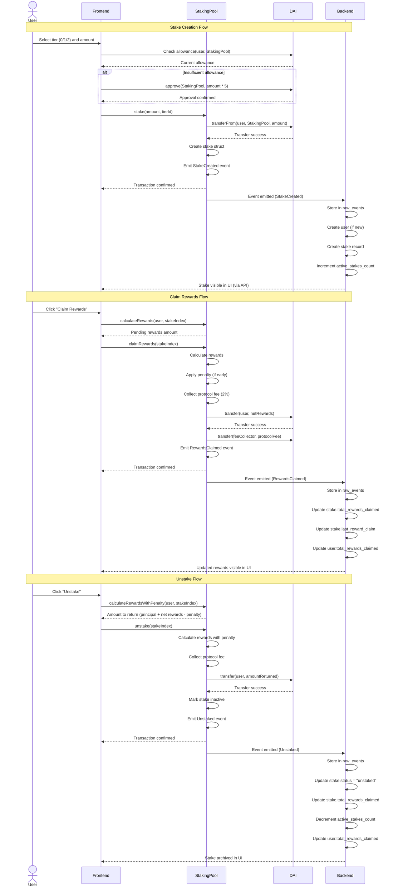

# ChainStaker - Smart Contracts Documentation

Complete reference for ChainStaker smart contracts, staking mechanics, and contract interactions.

## Table of Contents

1. [Contract Architecture](#contract-architecture)
2. [Smart Contract Interaction Flow](#smart-contract-interaction-flow)
3. [Staking Mechanics](#staking-mechanics)
4. [Contract Files](#contract-files)
5. [ABI Reference](#abi-reference)
6. [Deployment](#deployment)

---

## Contract Architecture

ChainStaker uses a **modular architecture** with 6 Solidity files organized in an inheritance hierarchy:

```
StakingPool (main contract, user-facing)
  └── StakingAdmin (admin functions)
      └── StakingRewards (reward logic, penalties)
          └── StakingCore (core state, data structures)
              ├── Pausable (OpenZeppelin)
              ├── ReentrancyGuard (OpenZeppelin)
              └── Ownable (OpenZeppelin)

StakingMath (library for gas-optimized calculations)
IStakingPool (interface, placeholder)
```

### Contract Files

| File | Type | Lines | Purpose |
|------|------|-------|---------|
| `StakingPool.sol` | Contract | 114 | Main entry point, user functions (stake, unstake, claimRewards) |
| `StakingCore.sol` | Abstract | 64 | Core state, data structures, events |
| `StakingRewards.sol` | Abstract | 101 | Reward calculations, tier logic, penalty logic |
| `StakingAdmin.sol` | Abstract | 93 | Admin functions (updateTier, setProtocolFee, pause) |
| `StakingMath.sol` | Library | 26 | Pure math functions (gas-optimized) |
| `IStakingPool.sol` | Interface | - | Interface definition (currently empty) |

### Key Design Patterns

1. **Modular Inheritance**: Separation of concerns across 4 abstract contracts
2. **Library Pattern**: StakingMath as pure functions for gas optimization
3. **Security**: ReentrancyGuard on all state-changing functions
4. **Circuit Breaker**: Pausable pattern for emergency stops
5. **Access Control**: Ownable for admin-only functions
6. **Solvency Checks**: `_checkSolvency()` prevents overdrawn reward pool

---

## Smart Contract Interaction Flow

The following sequence diagram shows the complete interaction flow for staking, claiming rewards, and unstaking:



---

## Staking Mechanics

### Staking Tiers

ChainStaker offers 3 staking tiers with progressive APY rates and lock periods:

| Tier ID | Lock Period | APY | Early Withdrawal Penalty | Basis Points (BPS) |
|---------|-------------|-----|--------------------------|---------------------|
| 0 | 7 days | 5% | 20% of rewards | 500 / 2000 |
| 1 | 30 days | 8% | 30% of rewards | 800 / 3000 |
| 2 | 90 days | 12% | 50% of rewards | 1200 / 5000 |

**Note**: APY and penalties are stored in basis points (BPS) where 10,000 BPS = 100%.

### Reward Calculation Formula

Rewards are calculated using the StakingMath library:

```solidity
// Formula: rewards = (amount * apy * duration) / (365 days * 10000)
function calculateRewards(
    uint256 amount,
    uint256 apyBps,
    uint256 duration
) public pure returns (uint256) {
    return (amount * apyBps * duration) / (365 days * 10000);
}
```

**Example**:
- Stake: 1,000 DAI
- Tier: 1 (30 days, 8% APY = 800 BPS)
- Duration: 30 days (2,592,000 seconds)

```
rewards = (1000e18 * 800 * 2592000) / (31536000 * 10000)
        = 2,073,600,000,000,000,000,000,000 / 315,360,000,000
        = 6,575,342,465,753,424 wei
        = ~6.58 DAI
```

### Early Withdrawal Penalty Logic

If a user unstakes before the tier's minimum duration, an early withdrawal penalty is applied:

```solidity
// Check if early withdrawal
uint256 stakeDuration = block.timestamp - stake.startTime;
if (stakeDuration < tier.minDuration) {
    // Calculate gross rewards
    uint256 grossRewards = StakingMath.calculateRewards(
        stake.amount,
        tier.apy,
        stakeDuration
    );

    // Apply early withdrawal penalty
    uint256 penalty = StakingMath.applyPenalty(
        grossRewards,
        tier.earlyWithdrawPenalty
    );

    uint256 netRewards = grossRewards - penalty;

    // Apply protocol fee (2%) on net rewards
    uint256 protocolFee = StakingMath.calculateProtocolFee(
        netRewards,
        protocolFeeBps
    );

    uint256 userRewards = netRewards - protocolFee;

    // Return principal + user rewards
    uint256 amountToReturn = stake.amount + userRewards;
}
```

**Example with Penalty**:
- Stake: 1,000 DAI in Tier 2 (90 days, 12% APY)
- Unstake after 15 days (early withdrawal)
- Gross rewards: ~4.93 DAI
- Penalty (50%): 2.47 DAI
- Net rewards: 2.46 DAI
- Protocol fee (2% of net): 0.05 DAI
- User rewards: 2.41 DAI
- Amount returned: 1,002.41 DAI

### Protocol Fee

A 2% protocol fee is collected on all reward claims and unstakes:

```solidity
uint256 protocolFee = (netRewards * protocolFeeBps) / 10000;
// protocolFeeBps = 200 (2%)
```

The fee is transferred to the `feeCollector` address (configurable by owner).

### Edge Cases

**1. Zero Rewards Claim**

If a user tries to claim rewards immediately after staking (< 1 minute), the transaction reverts:

```solidity
require(rewards > 0, "No rewards to claim");
```

**2. Unstake Inactive Stake**

If a user tries to unstake an already unstaked stake:

```solidity
require(stake.active, "Stake is not active");
```

**3. Emergency Withdrawal**

When the contract is paused, users can only perform emergency withdrawals (no rewards):

```solidity
function emergencyWithdraw(uint256 stakeIndex) external whenPaused nonReentrant {
    // Transfer only principal, no rewards
    daiToken.transfer(msg.sender, stake.amount);
}
```

---

## Contract Files

### StakingPool.sol (Main Contract)

**Key Functions**:
- `stake(uint256 amount, uint256 tierId)`: Create new stake
- `unstake(uint256 stakeIndex)`: Unstake and claim rewards
- `claimRewards(uint256 stakeIndex)`: Claim rewards without unstaking
- `calculateRewards(address user, uint256 stakeIndex)`: View function for pending rewards
- `emergencyWithdraw(uint256 stakeIndex)`: Emergency withdrawal when paused

**Initialization**:
```solidity
constructor(
    address _daiToken,
    uint256 _maxStakePerUser,
    uint256 _maxTotalStake,
    uint256 _protocolFeeBps,
    address _feeCollector
) {
    // Initialize contract
    // Setup 3 default tiers (7d/30d/90d)
}
```

### StakingCore.sol (Abstract Base)

**Data Structures**:
```solidity
struct Stake {
    uint256 amount;
    uint256 startTime;
    uint256 lastRewardClaim;
    uint256 tierId;
    bool active;
}

mapping(address => Stake[]) public userStakes;
uint256 public totalStaked;
uint256 public rewardPoolBalance;
```

**Events**:
- `StakeCreated(address indexed user, uint256 indexed stakeIndex, uint256 amount, uint256 tierId, uint256 startTime)`
- `Unstaked(address indexed user, uint256 indexed stakeIndex, uint256 amountReturned)`
- `RewardsClaimed(address indexed user, uint256 indexed stakeIndex, uint256 rewards)`
- `EmergencyWithdraw(address indexed user, uint256 indexed stakeIndex, uint256 amount)`
- `RewardPoolFunded(uint256 amount, uint256 timestamp)`

### StakingRewards.sol (Abstract)

**Tier Management**:
```solidity
struct StakeTier {
    uint256 minDuration;
    uint256 apy; // in basis points (500 = 5%)
    uint256 earlyWithdrawPenalty; // in basis points (2000 = 20%)
}

mapping(uint256 => StakeTier) public tiers;
```

**Reward Functions**:
- `_calculateRewards(address user, uint256 stakeIndex)`: Calculate pending rewards
- `_calculateRewardsWithPenalty(address user, uint256 stakeIndex)`: Calculate with early withdrawal penalty
- `_collectProtocolFee(uint256 rewards)`: Collect 2% protocol fee

### StakingAdmin.sol (Abstract)

**Admin Functions** (onlyOwner):
- `updateTier(uint256 tierId, uint256 minDuration, uint256 apy, uint256 penalty)`: Update tier parameters
- `setProtocolFee(uint256 _protocolFeeBps)`: Update protocol fee (max: 10%)
- `setFeeCollector(address _feeCollector)`: Update fee collector address
- `fundRewardPool(uint256 amount)`: Owner funds the reward pool with DAI
- `pause()` / `unpause()`: Emergency pause

**Stake Limits**:
- `maxStakePerUser`: Maximum stake per user (default: 10,000 DAI)
- `maxTotalStake`: Maximum total staked across all users (default: 1,000,000 DAI)

### StakingMath.sol (Library)

**Pure Functions**:
```solidity
// Calculate rewards
function calculateRewards(uint256 amount, uint256 apyBps, uint256 duration)
    public pure returns (uint256);

// Apply penalty
function applyPenalty(uint256 amount, uint256 penaltyBps)
    public pure returns (uint256);

// Calculate protocol fee
function calculateProtocolFee(uint256 amount, uint256 feeBps)
    public pure returns (uint256);
```

**Constants**:
- `YEAR_IN_SECONDS`: 365 days in seconds (31,536,000)
- `BASIS_POINTS`: 10,000 (100% in basis points)

---

## ABI Reference

### Key Function ABIs

**stake()**
```json
{
  "inputs": [
    {"internalType": "uint256", "name": "amount", "type": "uint256"},
    {"internalType": "uint256", "name": "tierId", "type": "uint256"}
  ],
  "name": "stake",
  "outputs": [],
  "stateMutability": "nonpayable",
  "type": "function"
}
```

**unstake()**
```json
{
  "inputs": [
    {"internalType": "uint256", "name": "stakeIndex", "type": "uint256"}
  ],
  "name": "unstake",
  "outputs": [],
  "stateMutability": "nonpayable",
  "type": "function"
}
```

**claimRewards()**
```json
{
  "inputs": [
    {"internalType": "uint256", "name": "stakeIndex", "type": "uint256"}
  ],
  "name": "claimRewards",
  "outputs": [],
  "stateMutability": "nonpayable",
  "type": "function"
}
```

**calculateRewards() (view)**
```json
{
  "inputs": [
    {"internalType": "address", "name": "user", "type": "address"},
    {"internalType": "uint256", "name": "stakeIndex", "type": "uint256"}
  ],
  "name": "calculateRewards",
  "outputs": [
    {"internalType": "uint256", "name": "", "type": "uint256"}
  ],
  "stateMutability": "view",
  "type": "function"
}
```

**getUserStake() (view)**
```json
{
  "inputs": [
    {"internalType": "address", "name": "user", "type": "address"},
    {"internalType": "uint256", "name": "stakeIndex", "type": "uint256"}
  ],
  "name": "getUserStake",
  "outputs": [
    {
      "components": [
        {"internalType": "uint256", "name": "amount", "type": "uint256"},
        {"internalType": "uint256", "name": "startTime", "type": "uint256"},
        {"internalType": "uint256", "name": "lastRewardClaim", "type": "uint256"},
        {"internalType": "uint256", "name": "tierId", "type": "uint256"},
        {"internalType": "bool", "name": "active", "type": "bool"}
      ],
      "internalType": "struct StakingCore.Stake",
      "name": "",
      "type": "tuple"
    }
  ],
  "stateMutability": "view",
  "type": "function"
}
```

### Event ABIs

**StakeCreated**
```json
{
  "anonymous": false,
  "inputs": [
    {"indexed": true, "internalType": "address", "name": "user", "type": "address"},
    {"indexed": true, "internalType": "uint256", "name": "stakeIndex", "type": "uint256"},
    {"indexed": false, "internalType": "uint256", "name": "amount", "type": "uint256"},
    {"indexed": false, "internalType": "uint256", "name": "tierId", "type": "uint256"},
    {"indexed": false, "internalType": "uint256", "name": "startTime", "type": "uint256"}
  ],
  "name": "StakeCreated",
  "type": "event"
}
```

**RewardsClaimed**
```json
{
  "anonymous": false,
  "inputs": [
    {"indexed": true, "internalType": "address", "name": "user", "type": "address"},
    {"indexed": true, "internalType": "uint256", "name": "stakeIndex", "type": "uint256"},
    {"indexed": false, "internalType": "uint256", "name": "rewards", "type": "uint256"}
  ],
  "name": "RewardsClaimed",
  "type": "event"
}
```

**Unstaked**
```json
{
  "anonymous": false,
  "inputs": [
    {"indexed": true, "internalType": "address", "name": "user", "type": "address"},
    {"indexed": true, "internalType": "uint256", "name": "stakeIndex", "type": "uint256"},
    {"indexed": false, "internalType": "uint256", "name": "amountReturned", "type": "uint256"}
  ],
  "name": "Unstaked",
  "type": "event"
}
```

---

## Deployment

### Deployment Script (Deploy.s.sol)

```solidity
// Key deployment parameters
MAX_STAKE_PER_USER = 10_000 ether;
MAX_TOTAL_STAKE = 1_000_000 ether;
PROTOCOL_FEE_BPS = 200; // 2%
INITIAL_REWARD_POOL = 500_000 ether;
```

### Sepolia Deployment

**Deployed Contracts**:
- StakingPool: [`0xa247e02E9309cCEB1D1b9b301607f067d0a70c28`](https://sepolia.etherscan.io/address/0xa247e02E9309cCEB1D1b9b301607f067d0a70c28)
- DAI Token: [`0x2FA332E8337642891885453Fd40a7a7Bb010B71a`](https://sepolia.etherscan.io/address/0x2FA332E8337642891885453Fd40a7a7Bb010B71a)
- MockDAI Provider: `0xB1547d572781A58Ae4DcC9Ad29CE92A57C94831c`

**Network**: Sepolia Testnet (Chain ID: 11155111)
**Start Block**: 9662396

### Verification on Etherscan

```bash
forge verify-contract \
  --chain-id 11155111 \
  --etherscan-api-key $ETHERSCAN_API_KEY \
  --constructor-args $(cast abi-encode "constructor(address,uint256,uint256,uint256,address)" $DAI_ADDRESS $MAX_STAKE $MAX_TOTAL $FEE_BPS $FEE_COLLECTOR) \
  $STAKING_POOL_ADDRESS \
  src/StakingPool.sol:StakingPool
```

---

For architecture details, see [ARCHITECTURE.md](../architecture/ARCHITECTURE.md).
For API integration, see [API.md](../api/API.md).
For deployment instructions, see [SEPOLIA.md](../deployment/SEPOLIA.md).
