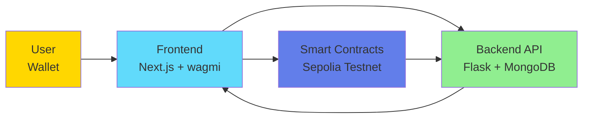

# ChainStaker - Multi-Tier DeFi Staking Platform

  

ChainStaker is a decentralized staking platform built on Ethereum that allows users to stake DAI (stablecoin) and earn rewards through multiple tiers with different APY rates and lock periods. The platform features real-time analytics, flexible reward claims, and an event-driven architecture with comprehensive backend aggregation.

## Key Features

- **Multi-Tier Staking**: Three staking tiers (7 days / 30 days / 90 days) with progressive APY rates (5% / 8% / 12%)
- **Flexible Reward Claims**: Claim rewards anytime with early withdrawal penalties based on tier duration
- **Real-Time Analytics Dashboard**: TVL sparkline, top stakers leaderboard, activity heatmap, and rewards timeline
- **Event-Driven Architecture**: Blockchain listener captures events, MongoDB stores state, Celery aggregates metrics every 5-15 minutes
- **Deployed on Sepolia Testnet**: Fully functional with test DAI, ready for portfolio demonstration

## Tech Stack

**Smart Contracts**
- Solidity 0.8.20, Foundry, OpenZeppelin (Ownable, Pausable, ReentrancyGuard)
- Modular architecture: StakingPool + 3 abstract contracts + StakingMath library

**Backend**
- Python 3.11, Flask REST API, MongoDB, Redis, Celery, Web3.py
- Docker Compose infrastructure with 6 services (API, MongoDB, Redis, Celery Worker, Celery Beat, Blockchain Listener)
- 20+ REST endpoints, 8 scheduled Celery tasks (5-15 min intervals)

**Frontend**
- Next.js 14, TypeScript, wagmi v2, RainbowKit, TanStack Query, Recharts
- Responsive dashboard with auto-approval staking (5x buffer)
- History page with 4 advanced analytics charts

## System Overview



## Deployment

**Network**: Sepolia Testnet (Chain ID: 11155111)

**Deployed Contracts**:
- StakingPool: [`0xa247e02E9309cCEB1D1b9b301607f067d0a70c28`](https://sepolia.etherscan.io/address/0xa247e02E9309cCEB1D1b9b301607f067d0a70c28)
- DAI Token: [`0x2FA332E8337642891885453Fd40a7a7Bb010B71a`](https://sepolia.etherscan.io/address/0x2FA332E8337642891885453Fd40a7a7Bb010B71a)

## Quick Start

```bash
# 1. Clone and setup backend
cd backend
docker-compose up -d

# 2. Setup frontend
cd frontend
npm install
npm run dev

# 3. Connect wallet to Sepolia testnet
# Open http://localhost:3000 and connect with RainbowKit

# 4. Get test DAI from faucet and start staking
# Use Sepolia ETH faucet, then get test DAI from deployed MockDAI contract
```

## Documentation

- [Architecture](docs/architecture/ARCHITECTURE.md) - Complete system architecture with detailed Mermaid diagrams
- [API Reference](docs/api/API.md) - REST API endpoints, Celery tasks, and integration patterns
- [Smart Contracts](docs/smart-contracts/CONTRACTS.md) - Contract architecture, staking mechanics, and ABIs
- [Deployment Guide](docs/deployment/SEPOLIA.md) - Sepolia deployment details and Docker setup

## Author

**Félicien Astier** - [GitHub](https://github.com/astierfe)

Personal portfolio project demonstrating full-stack Web3 development. No license. Deployed on Sepolia testnet only.
